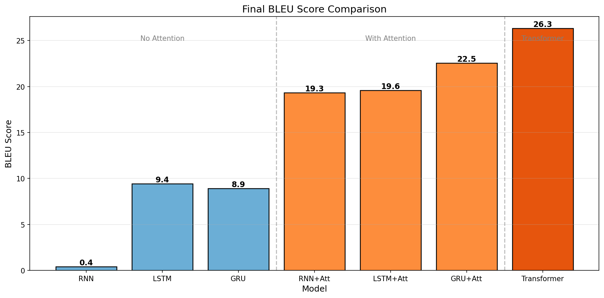

# Seq2Seq 机器翻译实验

自然语言处理课程作业：基于Seq2Seq模型的中英机器翻译

## 项目结构

```
├── data/                    # 数据集
│   ├── zh_en_train.txt     # 训练集 (26,187条)
│   ├── zh_en_val.txt       # 验证集 (1,000条)
│   └── zh_en_test.txt      # 测试集 (1,000条)
├── docs/
│   └── 研究报告.md          # 研究报告
├── figures/                 # 可视化图表
├── logs/                    # 训练日志
├── checkpoints/             # 模型权重
├── scripts/                 # 实验脚本
│   ├── exp1_rnn_variants.sh    # RNN/LSTM/GRU实验
│   ├── exp2_attention.sh       # Attention实验
│   ├── exp3_transformer.sh     # Transformer实验
│   ├── exp_ablation.sh         # 消融实验
│   ├── plot_comparison.py      # 绘制对比图
│   ├── plot_ablation.py        # 绘制消融实验图
│   ├── plot_attention.py       # 绘制Attention热力图
│   └── case_analysis.py        # 案例分析
├── seq2seq_models.py        # RNN/LSTM/GRU + Attention 模型实现
├── transformer.py           # Transformer 模型实现
├── train.py                 # 训练脚本
├── utils.py                 # 工具函数
├── seq2seq-rnn.py          # 原始baseline代码
└── requirements.txt         # 依赖包
```

## 环境配置

```bash
pip install -r requirements.txt
```

## 快速开始

### 训练模型

```bash
# RNN (baseline)
python train.py --model_type rnn --num_epoch 20

# LSTM
python train.py --model_type lstm --num_epoch 20

# GRU
python train.py --model_type gru --num_epoch 20

# RNN + Attention
python train.py --model_type rnn --use_attention --num_epoch 20

# LSTM + Attention
python train.py --model_type lstm --use_attention --num_epoch 20

# GRU + Attention
python train.py --model_type gru --use_attention --num_epoch 20

# Transformer
python train.py --model_type transformer --num_layers 3 --num_heads 8 --num_epoch 20
```

### 运行全部实验

```bash
bash scripts/exp1_rnn_variants.sh   # RNN变体实验
bash scripts/exp2_attention.sh      # Attention实验
bash scripts/exp3_transformer.sh    # Transformer实验
bash scripts/exp_ablation.sh        # 消融实验
```

### 生成可视化图表

```bash
python scripts/plot_comparison.py   # 训练曲线和最终结果对比
python scripts/plot_ablation.py     # 消融实验图表
python scripts/plot_attention.py    # Attention热力图
```

## 实验结果

| 模型 | 验证BLEU | 测试BLEU | 训练时间(GPU) |
|------|---------|----------|--------------|
| RNN | 0.90 | 0.75 | ~97s |
| LSTM | 9.44 | 9.36 | ~345s |
| GRU | 9.02 | 7.99 | ~329s |
| RNN+Attention | 19.33 | 18.13 | ~243s |
| LSTM+Attention | 20.20 | 17.37 | ~377s |
| GRU+Attention | 22.54 | 19.76 | ~345s |
| Transformer | 26.95 | 25.45 | ~509s |



## 模型实现说明

### LSTM/GRU
- 基于 `nn.Linear` 手动实现，未调用 `nn.LSTMCell` 或 `nn.GRUCell`
- 代码位于 `seq2seq_models.py`

### Attention
- 实现 Bahdanau 加性注意力机制
- Decoder每步计算对Encoder所有隐状态的注意力权重

### Transformer
- 基于 `nn.Linear` 实现多头注意力，未调用 `nn.Transformer`
- 配置：`num_layers=3, num_heads=8, d_model=256, d_ff=512, dropout=0.1`
- 代码位于 `transformer.py`

## 参考资料

- [Understanding LSTM Networks](https://colah.github.io/posts/2015-08-Understanding-LSTMs/)
- [Seq2seq and Attention](https://lena-voita.github.io/nlp_course/seq2seq_and_attention.html)
- [The Illustrated Transformer](https://jalammar.github.io/illustrated-transformer/)
