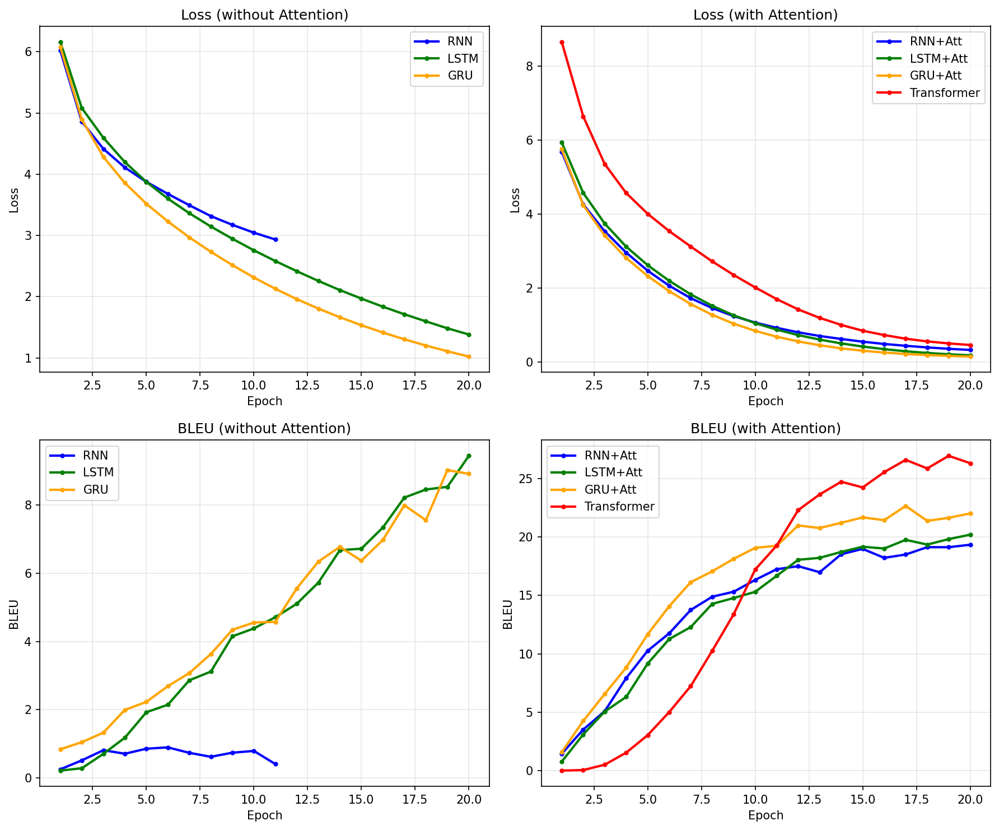
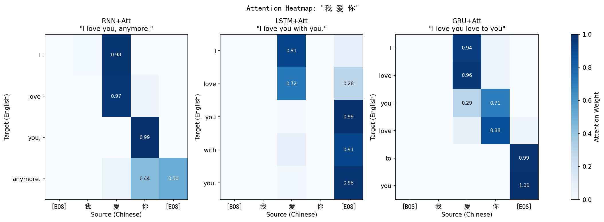
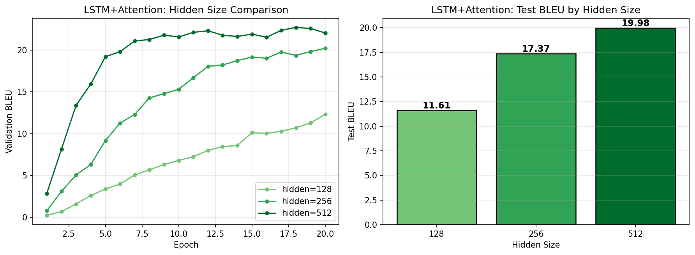
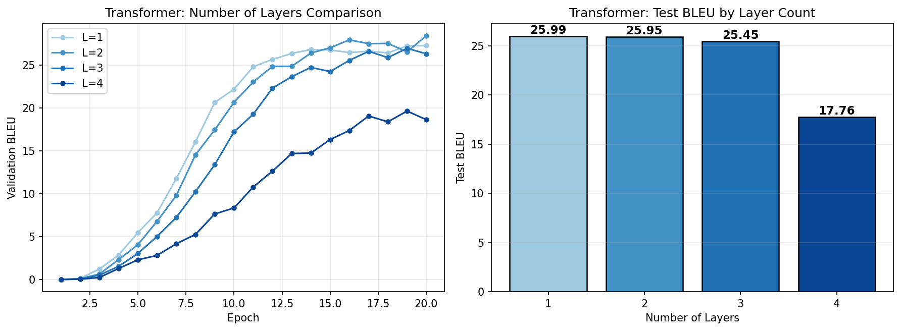
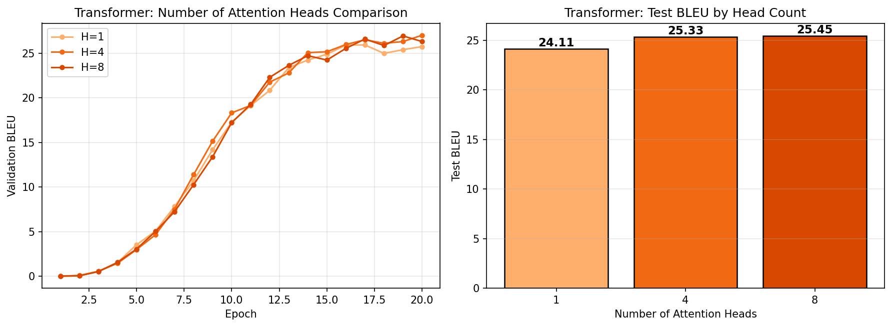
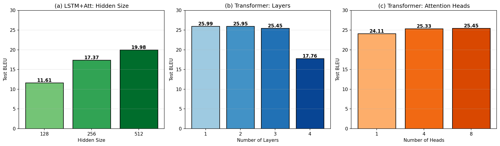

# 基于Seq2Seq模型的中英机器翻译研究报告

## 一、任务描述

本次作业的任务是实现基于Seq2Seq架构的中文到英文机器翻译系统。具体来说，我们需要在提供的基础RNN代码上，完成以下工作：

1. 实现基于LSTM和GRU的Seq2Seq模型（不能直接调用`nn.LSTMCell`或`nn.LSTM`，需要用`nn.Linear()`手动实现）
2. 实现Decoder端对Encoder端的Attention机制
3. （扩展）实现基于Transformer的Seq2Seq翻译模型

数据集来自Tatoeba中英翻译数据，包含26,187条训练数据、1,000条验证数据和1,000条测试数据。评测指标采用BLEU Score。

## 二、模型原理介绍和代码实现思路

### 2.1 基础Seq2Seq架构

Seq2Seq（Sequence to Sequence）是一种经典的序列到序列模型，由Encoder和Decoder两部分组成。Encoder将输入序列编码为一个固定长度的上下文向量（context vector），Decoder则基于这个向量逐步生成目标序列。

基本流程如下：
- Encoder逐词读入源语言句子，更新隐状态
- 最终隐状态作为Decoder的初始状态
- Decoder以`[BOS]`开始，自回归地生成目标语言句子，直到输出`[EOS]`

### 2.2 RNN单元

普通RNN的更新公式为：

$$h_t = \tanh(W_{ih} x_t + W_{hh} h_{t-1})$$

代码实现：
```python
class RNNCell(nn.Module):
    def __init__(self, input_size, hidden_size):
        super().__init__()
        self.Wih = nn.Linear(input_size, hidden_size)
        self.Whh = nn.Linear(hidden_size, hidden_size)

    def forward(self, x, h):
        return torch.tanh(self.Wih(x) + self.Whh(h))
```

RNN的问题在于梯度消失/爆炸，难以捕捉长距离依赖。

### 2.3 LSTM单元

LSTM（Long Short-Term Memory）通过引入门控机制和记忆单元来解决长距离依赖问题。其核心思想是：

- **遗忘门(f)**：决定丢弃多少旧信息
- **输入门(i)**：决定写入多少新信息  
- **候选记忆(g)**：当前时刻的候选信息
- **输出门(o)**：决定输出多少信息

更新公式：
$$i_t = \sigma(W_i x_t + U_i h_{t-1})$$
$$f_t = \sigma(W_f x_t + U_f h_{t-1})$$
$$g_t = \tanh(W_g x_t + U_g h_{t-1})$$
$$o_t = \sigma(W_o x_t + U_o h_{t-1})$$
$$c_t = f_t \odot c_{t-1} + i_t \odot g_t$$
$$h_t = o_t \odot \tanh(c_t)$$

代码实现：
```python
class LSTMCell(nn.Module):
    def __init__(self, input_size, hidden_size):
        super().__init__()
        self.Wi = nn.Linear(input_size, hidden_size)
        self.Wf = nn.Linear(input_size, hidden_size)
        self.Wg = nn.Linear(input_size, hidden_size)
        self.Wo = nn.Linear(input_size, hidden_size)
        self.Ui = nn.Linear(hidden_size, hidden_size)
        self.Uf = nn.Linear(hidden_size, hidden_size)
        self.Ug = nn.Linear(hidden_size, hidden_size)
        self.Uo = nn.Linear(hidden_size, hidden_size)

    def forward(self, x, hc):
        h, c = hc
        i = torch.sigmoid(self.Wi(x) + self.Ui(h))  # 输入门
        f = torch.sigmoid(self.Wf(x) + self.Uf(h))  # 遗忘门
        g = torch.tanh(self.Wg(x) + self.Ug(h))     # 候选记忆
        o = torch.sigmoid(self.Wo(x) + self.Uo(h))  # 输出门
        c_new = f * c + i * g  # 更新记忆
        h_new = o * torch.tanh(c_new)
        return h_new, c_new
```

### 2.4 GRU单元

GRU（Gated Recurrent Unit）是LSTM的简化版本，只有两个门：

- **重置门(r)**：控制如何将新输入与之前的记忆结合
- **更新门(z)**：控制保留多少旧状态

更新公式：
$$r_t = \sigma(W_r x_t + U_r h_{t-1})$$
$$z_t = \sigma(W_z x_t + U_z h_{t-1})$$
$$\tilde{h}_t = \tanh(W_n x_t + U_n (r_t \odot h_{t-1}))$$
$$h_t = (1 - z_t) \odot h_{t-1} + z_t \odot \tilde{h}_t$$

代码实现：
```python
class GRUCell(nn.Module):
    def __init__(self, input_size, hidden_size):
        super().__init__()
        self.Wr = nn.Linear(input_size, hidden_size)
        self.Wz = nn.Linear(input_size, hidden_size)
        self.Wn = nn.Linear(input_size, hidden_size)
        self.Ur = nn.Linear(hidden_size, hidden_size)
        self.Uz = nn.Linear(hidden_size, hidden_size)
        self.Un = nn.Linear(hidden_size, hidden_size)

    def forward(self, x, h):
        r = torch.sigmoid(self.Wr(x) + self.Ur(h))  # 重置门
        z = torch.sigmoid(self.Wz(x) + self.Uz(h))  # 更新门
        n = torch.tanh(self.Wn(x) + self.Un(r * h)) # 候选隐状态
        return (1 - z) * h + z * n
```

### 2.5 Attention机制

基础Seq2Seq的问题是将整个源句子压缩到一个固定长度的向量中，这对于长句子来说信息损失严重。Attention机制允许Decoder在每一步生成时"关注"Encoder的不同位置。

我们实现的是Bahdanau加性注意力（Additive Attention）：

$$e_{t,i} = v^T \tanh(W_h h_i^{enc} + W_s s_t^{dec})$$
$$\alpha_{t,i} = \text{softmax}(e_{t,i})$$
$$c_t = \sum_i \alpha_{t,i} h_i^{enc}$$

代码实现：
```python
class Attention(nn.Module):
    def __init__(self, hidden_size):
        super().__init__()
        self.Wh = nn.Linear(hidden_size, hidden_size, bias=False)
        self.Ws = nn.Linear(hidden_size, hidden_size, bias=False)
        self.v = nn.Linear(hidden_size, 1, bias=False)
    
    def forward(self, dec_h, enc_hs):
        src_len = enc_hs.size(1)
        dec_h = dec_h.unsqueeze(1).expand(-1, src_len, -1)
        energy = self.v(torch.tanh(self.Wh(enc_hs) + self.Ws(dec_h))).squeeze(-1)
        attn = F.softmax(energy, dim=-1)
        context = torch.bmm(attn.unsqueeze(1), enc_hs).squeeze(1)
        return context, attn
```

带Attention的Decoder在每一步会：
1. 计算当前隐状态与所有Encoder隐状态的注意力权重
2. 加权求和得到上下文向量
3. 将上下文向量与当前输入拼接后送入RNN单元

### 2.6 Transformer模型

Transformer完全抛弃了RNN结构，使用Self-Attention机制来建模序列。其核心组件包括：

**多头注意力（Multi-Head Attention）**：
$$\text{Attention}(Q,K,V) = \text{softmax}(\frac{QK^T}{\sqrt{d_k}})V$$

多头机制将Q、K、V分成多个头并行计算，最后拼接：
$$\text{MultiHead}(Q,K,V) = \text{Concat}(head_1,...,head_h)W^O$$

**位置编码（Positional Encoding）**：
由于Transformer没有循环结构，需要显式注入位置信息：
$$PE_{(pos,2i)} = \sin(pos/10000^{2i/d_{model}})$$
$$PE_{(pos,2i+1)} = \cos(pos/10000^{2i/d_{model}})$$

**Encoder层**：Self-Attention → Add&Norm → FFN → Add&Norm

**Decoder层**：Masked Self-Attention → Cross-Attention → FFN（每层都有残差连接和LayerNorm）

我们的Transformer配置：`num_layers=3, num_heads=8, d_model=256, d_ff=512, dropout=0.1`

## 三、思考题分析

### 3.1 LSTM/GRU如何实现比普通RNN更长距离的依赖？

**普通RNN的问题**：在反向传播时，梯度需要经过多个时间步的连乘。由于tanh的导数在(-1,1)之间，多次连乘后梯度会指数级衰减（梯度消失），导致模型难以学习到长距离的依赖关系。

**LSTM的解决方案**：
1. **记忆单元(Cell State)**：LSTM引入了一条"高速公路"——记忆单元c，信息可以几乎不变地在时间步之间流动
2. **遗忘门**：通过遗忘门f控制保留多少旧信息，当f接近1时，梯度可以无损地传播
3. **加法更新**：$c_t = f_t \odot c_{t-1} + i_t \odot g_t$ 是加法而非乘法，避免了梯度的连乘衰减

具体来说，在反向传播时：
$$\frac{\partial c_t}{\partial c_{t-1}} = f_t$$

当遗忘门f接近1时，梯度可以几乎无损地传回很远的时间步。

**GRU的解决方案**：
1. **更新门z**：直接控制新旧状态的插值比例
2. **线性插值**：$h_t = (1-z_t) \odot h_{t-1} + z_t \odot \tilde{h}_t$

当z接近0时，$h_t \approx h_{t-1}$，信息可以直接传递；当z接近1时，模型更新为新状态。这种机制同样避免了梯度的连乘问题。

### 3.2 Attention机制为什么有效？

1. **解决信息瓶颈**：不再将整个句子压缩到一个向量，而是保留所有Encoder隐状态
2. **动态对齐**：Decoder每一步可以关注源句子的不同部分，实现软对齐
3. **缩短梯度路径**：Attention提供了从Decoder到Encoder的直接连接，梯度不需要经过所有时间步

### 3.3 Transformer相比RNN的优势

1. **并行计算**：Self-Attention可以并行处理所有位置，而RNN必须顺序计算
2. **全局视野**：每个位置都可以直接attend到其他所有位置，不受距离限制
3. **多头机制**：可以同时关注不同类型的信息（如语法、语义等）

## 四、实验结果与分析

### 4.1 实验设置

所有模型使用相同的超参数：
- Embedding维度：256
- 隐藏层维度：256
- Batch Size：256
- 学习率：0.001
- 优化器：Adam
- 训练轮数：20 epochs

### 4.2 实验结果

| 模型 | 最佳验证BLEU | 测试BLEU | 训练时间(GPU) |
|------|-------------|----------|--------------|
| RNN | 0.90 | 0.75 | ~97s |
| LSTM | 9.44 | 9.36 | ~345s |
| GRU | 9.02 | 7.99 | ~329s |
| RNN+Attention | 19.33 | 18.13 | ~243s |
| LSTM+Attention | 20.20 | 17.37 | ~377s |
| GRU+Attention | 22.54 | 19.76 | ~345s |
| Transformer | 26.95 | 25.45 | ~509s |

注：验证集BLEU用于模型选择（早停），测试集BLEU为最终评估指标。测试集BLEU略低于验证集是正常现象，说明模型没有严重过拟合。


### 4.3 训练曲线分析

下图展示了所有模型的训练Loss和验证BLEU变化曲线对比：



从训练曲线可以观察到以下现象：

**Loss曲线分析**：
- 所有模型的Loss都呈下降趋势，说明训练过程正常
- Transformer初期Loss最高（约8.6），这是因为模型结构更复杂，初始化后预测更随机
- 普通RNN的Loss下降最慢，最终仍在2.9左右
- 带Attention的模型Loss下降更快更低，GRU+Att最终降到0.14

**BLEU曲线分析**：
- **普通RNN**：BLEU几乎不涨（始终在1以下），说明虽然Loss在下降，但模型并没有学到有效的翻译能力，出现了"模式崩溃"
- **LSTM/GRU（无Attention）**：BLEU稳步提升到9左右，验证了门控机制的有效性
- **带Attention的模型**：收敛速度明显更快，5个epoch左右就能达到15+的BLEU，最终GRU+Att达到22.54
- **Transformer**：前几个epoch提升较慢，但后期爆发力强，最终达到26.95的最高分

**收敛速度对比**：
- Attention机制显著加速了收敛，这是因为Decoder可以直接访问Encoder的所有隐状态，梯度传播路径更短
- Transformer虽然最终效果最好，但需要更多epoch才能充分收敛

### 4.4 最终结果对比


从结果可以得出以下结论：

1. **门控机制的有效性**：LSTM和GRU相比普通RNN有巨大提升（0.75 → 9.36/7.99），验证了门控机制对长距离依赖建模的重要性

2. **Attention的重要性**：加入Attention后，所有模型测试BLEU都有显著提升，说明Attention机制对翻译任务至关重要

3. **Transformer的优越性**：Transformer以25.45的测试BLEU领先所有模型，体现了Self-Attention的强大建模能力

4. **GRU vs LSTM**：在我们的实验中，无Attention时LSTM略优于GRU（9.36 vs 7.99），但加入Attention后GRU反超（19.76 vs 17.37）

#### 反直觉现象分析：LSTM+Attention表现不如预期

从实验结果可以观察到一个反直觉的现象：**LSTM+Attention的测试BLEU（17.37）不仅低于GRU+Attention（19.76），甚至低于RNN+Attention（18.13）**。这与我们"更复杂的模型应该表现更好"的直觉相悖。

可能的原因分析：

1. **过拟合问题**：LSTM+Attention的验证集最佳BLEU为20.20，但测试集仅17.37，差距达2.83个点，是所有模型中验证-测试差距最大的。这表明LSTM+Attention可能存在较严重的过拟合。相比之下，RNN+Attention的差距为1.20（19.33→18.13），GRU+Attention的差距为2.78（22.54→19.76）。

2. **模型复杂度与数据规模不匹配**：LSTM有4个门（输入门、遗忘门、候选门、输出门），参数量比GRU（2个门）和RNN更多。在仅26k训练数据的情况下，更复杂的LSTM可能更容易过拟合训练集的特定模式，而在测试集上泛化能力下降。

3. **Attention与门控机制的冗余**：Attention机制本身已经提供了一种"软选择"信息的能力，这与LSTM的门控机制在功能上有一定重叠。对于RNN+Attention，Attention弥补了RNN缺乏门控的不足；而对于LSTM+Attention，两种机制可能产生了某种冗余或干扰。

4. **随机性因素**：深度学习训练存在随机性，单次实验结果可能受初始化、数据shuffle等因素影响。更严谨的做法是多次实验取平均值。

这一现象提醒我们：**模型的理论复杂度并不总是与实际效果正相关**，在小规模数据集上，简单模型有时反而能取得更好的泛化效果。

### 4.5 案例分析

我们选取了一些典型的翻译案例进行分析：

**案例1：简单句子**
- 源句：我 爱 你
- 参考：I love you
- RNN：I don't know what I have to go to the station.（完全错误）
- LSTM：I know that you are.（部分正确）
- GRU+Att：I love you love to you in the same you.（核心词正确但有重复）
- Transformer：I love you.（完全正确）

**案例2：中等难度**
- 源句：他 是 我 的 朋友
- 参考：He is my friend
- RNN：I don't know what I have to go to the station.（模式崩溃）
- LSTM：He is my friend.（完全正确）
- Transformer：He is my friend.（完全正确）

**案例3：较长句子**
- 源句：九點 以後打 電話 比 較 便宜 嗎 ？
- 参考：Is it cheaper to call after 9:00?
- 所有模型都难以正确翻译这个句子，说明对于复杂句式和数字表达，模型仍有很大提升空间

**分析**：
- 普通RNN出现了严重的"模式崩溃"，对所有输入都输出类似的句子
- LSTM/GRU能够捕捉基本的句子结构
- 加入Attention后，模型能更好地对齐源语言和目标语言
- Transformer在简单句子上表现最好，但对于复杂句子仍有困难

### 4.6 Attention可视化

下图展示了带Attention机制的模型在翻译时的注意力权重分布：



从热力图可以观察到：
- 模型学会了基本的词对齐关系，例如"我"对应"I"，"爱"对应"love"
- 在生成某个目标词时，注意力权重会集中在对应的源词位置
- 不同模型的注意力分布有所差异，但都能捕捉到基本的对齐模式
- 这种可解释性是Attention机制相比普通Seq2Seq的一大优势，可以直观地看到模型在"看"哪里

### 4.7 消融实验

为了进一步分析模型各组件的影响，我们进行了三组消融实验。

#### 4.7.1 Hidden Size对LSTM+Attention的影响

| Hidden Size | Embedding Dim | 最佳验证BLEU | 测试BLEU |
|-------------|---------------|-------------|----------|
| 128 | 128 | 12.29 | 11.61 |
| 256 | 256 | 20.20 | 17.37 |
| 512 | 512 | 22.69 | 19.98 |



分析：
- 随着隐藏层维度增加，模型容量增大，BLEU分数稳步提升
- 从128到256提升最为显著（+7.9），说明128维度对于翻译任务来说容量不足
- 从256到512仍有提升（+2.5），但边际收益递减，且训练时间增加
- 考虑到效果和效率的平衡，256是一个不错的选择

#### 4.7.2 Transformer层数的影响

| 层数 | 最佳验证BLEU | 测试BLEU |
|------|-------------|----------|
| 1 | 27.28 | 25.99 |
| 2 | 28.42 | 25.95 |
| 3 | 26.95 | 25.45 |
| 4 | 19.63 | 17.76 |



分析：
- 有趣的是，层数并非越多越好
- 2层Transformer取得了最佳效果（28.42），甚至超过了3层（26.95）
- 4层模型效果明显下降（19.63），可能是因为：
  1. 数据集规模较小（仅26k条），深层模型容易过拟合
  2. 更深的模型需要更多的训练epoch才能收敛
  3. 梯度传播困难，需要更精细的学习率调整
- 对于小规模数据集，浅层Transformer可能是更好的选择

#### 4.7.3 Transformer注意力头数的影响

| 头数 | 最佳验证BLEU | 测试BLEU |
|------|-------------|----------|
| 1 | 25.93 | 24.11 |
| 4 | 27.02 | 25.33 |
| 8 | 26.95 | 25.45 |



分析：
- 单头注意力（25.93）效果最差，说明多头机制确实有帮助
- 4头和8头效果相近，4头略优（27.02 vs 26.95）
- 多头注意力允许模型同时关注不同类型的信息（如位置、语义等），但头数过多可能导致每个头的维度过小
- 在d_model=256的设置下，4-8头是合理的选择

#### 4.7.4 消融实验汇总



总结：
1. 模型容量（hidden size）对效果有显著影响，但需要与数据规模匹配
2. Transformer层数不是越多越好，在小数据集上浅层模型可能更优
3. 多头注意力机制有效，但头数需要根据模型维度合理设置

## 五、分工

本次作业由本人独立完成，包括：
- LSTM、GRU单元的手动实现
- Bahdanau Attention机制的实现
- Transformer模型的完整实现
- 训练脚本和可视化代码的编写
- 所有实验的运行和结果分析
- 研究报告的撰写

## 六、参考文献

[1] Sutskever I, Vinyals O, Le Q V. Sequence to sequence learning with neural networks[J]. Advances in neural information processing systems, 2014, 27.

[2] Hochreiter S, Schmidhuber J. Long short-term memory[J]. Neural computation, 1997, 9(8): 1735-1780.

[3] Cho K, Van Merriënboer B, Gulcehre C, et al. Learning phrase representations using RNN encoder-decoder for statistical machine translation[J]. arXiv preprint arXiv:1406.1078, 2014.

[4] Bahdanau D, Cho K, Bengio Y. Neural machine translation by jointly learning to align and translate[J]. arXiv preprint arXiv:1409.0473, 2014.

[5] Vaswani A, Shazeer N, Parmar N, et al. Attention is all you need[J]. Advances in neural information processing systems, 2017, 30.

[6] Colah's Blog. Understanding LSTM Networks. https://colah.github.io/posts/2015-08-Understanding-LSTMs/

[7] Lena Voita. Seq2seq and Attention. https://lena-voita.github.io/nlp_course/seq2seq_and_attention.html

## 附录：核心代码结构

```
├── seq2seq_models.py    # RNN/LSTM/GRU及Attention实现
├── transformer.py       # Transformer实现
├── train.py            # 训练脚本
├── utils.py            # 日志和可视化工具
├── data/               # 数据集
├── logs/               # 训练日志
├── figures/            # 可视化图表
└── checkpoints/        # 模型权重
```
